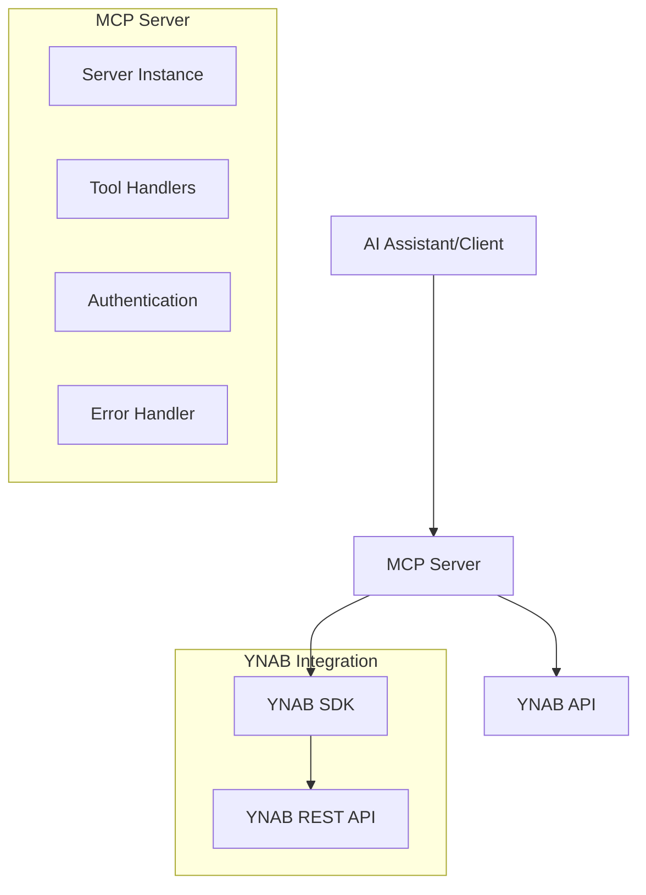

# Design Document

## Overview

The YNAB MCP Server is a Model Context Protocol server that provides AI assistants with secure access to You Need A Budget (YNAB) data and functionality. The server acts as a bridge between AI applications and the YNAB API, exposing budget management capabilities through standardized MCP tools.

The server is built using the official MCP TypeScript SDK and YNAB JavaScript SDK, ensuring compatibility and reliability. It follows MCP best practices for tool definition, error handling, and security.

## Architecture

### High-Level Architecture



### Component Architecture

The server follows a layered architecture:

1. **Transport Layer**: Handles MCP communication via stdio
2. **Server Layer**: Manages MCP protocol and tool registration
3. **Business Logic Layer**: Implements YNAB-specific operations
4. **Integration Layer**: Interfaces with YNAB SDK
5. **Data Layer**: YNAB API endpoints

## Components and Interfaces

### Core Server Class

```typescript
class YNABMCPServer {
  private server: Server;
  private ynabAPI: ynab.API;
  
  constructor();
  private setupToolHandlers(): void;
  private handleToolCall(request: CallToolRequest): Promise<CallToolResult>;
  async run(): Promise<void>;
}
```

### Tool Categories

#### Budget Management Tools
- `ynab:list_budgets`: Retrieve all user budgets
- `ynab:get_budget`: Get detailed budget information

#### Account Management Tools
- `ynab:list_accounts`: List accounts for a budget
- `ynab:get_account`: Get specific account details
- `ynab:create_account`: Create new account

#### Transaction Management Tools
- `ynab:list_transactions`: List transactions with filtering
- `ynab:get_transaction`: Get specific transaction
- `ynab:create_transaction`: Create new transaction
- `ynab:update_transaction`: Update existing transaction
- `ynab:delete_transaction`: Delete transaction

#### Category Management Tools
- `ynab:list_categories`: List budget categories
- `ynab:get_category`: Get specific category
- `ynab:update_category`: Update category budget

#### Payee Management Tools
- `ynab:list_payees`: List payees
- `ynab:get_payee`: Get specific payee

#### Monthly Data Tools
- `ynab:get_month`: Get monthly budget data
- `ynab:list_months`: List all months

#### Utility Tools
- `ynab:get_user`: Get user information
- `ynab:convert_amount`: Convert between dollars and milliunits

### Authentication Interface

```typescript
interface AuthenticationConfig {
  accessToken: string;
  validateToken(): Promise<boolean>;
}
```

### Tool Handler Interface

```typescript
interface ToolHandler {
  name: string;
  description: string;
  inputSchema: JSONSchema;
  handler: (args: any) => Promise<CallToolResult>;
}
```

## Data Models

### Core YNAB Data Types

#### Budget
```typescript
interface Budget {
  id: string;
  name: string;
  last_modified_on: string;
  first_month: string;
  last_month: string;
  date_format: DateFormat;
  currency_format: CurrencyFormat;
}
```

#### Account
```typescript
interface Account {
  id: string;
  name: string;
  type: AccountType;
  on_budget: boolean;
  closed: boolean;
  note?: string;
  balance: number; // in milliunits
  cleared_balance: number;
  uncleared_balance: number;
}
```

#### Transaction
```typescript
interface Transaction {
  id: string;
  date: string; // ISO format
  amount: number; // in milliunits
  memo?: string;
  cleared: ClearedStatus;
  approved: boolean;
  flag_color?: FlagColor;
  account_id: string;
  payee_id?: string;
  category_id?: string;
  transfer_account_id?: string;
}
```

#### Category
```typescript
interface Category {
  id: string;
  category_group_id: string;
  name: string;
  hidden: boolean;
  original_category_group_id?: string;
  note?: string;
  budgeted: number; // in milliunits
  activity: number;
  balance: number;
  goal_type?: GoalType;
  goal_creation_month?: string;
  goal_target?: number;
  goal_target_month?: string;
}
```

### MCP Response Types

```typescript
interface MCPToolResult {
  content: Array<{
    type: 'text';
    text: string;
  }>;
}
```

### Amount Conversion

All monetary values in YNAB are stored as milliunits (1/1000th of currency unit):
- $1.00 = 1000 milliunits
- Negative amounts represent outflows
- Integer arithmetic prevents floating-point precision issues

## Error Handling

### Error Classification

1. **Authentication Errors (401)**
   - Invalid or expired access token
   - Missing YNAB_ACCESS_TOKEN environment variable

2. **Authorization Errors (403)**
   - Insufficient permissions for requested operation

3. **Resource Not Found (404)**
   - Invalid budget_id, account_id, transaction_id, etc.

4. **Rate Limiting (429)**
   - Too many requests to YNAB API

5. **Server Errors (500)**
   - YNAB service unavailable
   - Internal server errors

### Error Response Format

```typescript
interface ErrorResponse {
  error: {
    code: ErrorCode;
    message: string;
    details?: any;
  };
}
```

### Error Handling Strategy

1. **Graceful Degradation**: Return meaningful error messages without exposing sensitive data
2. **Retry Logic**: Implement exponential backoff for rate-limited requests
3. **Validation**: Validate input parameters before API calls
4. **Logging**: Log errors for debugging without exposing tokens

## Testing Strategy

### Unit Testing

#### Tool Handler Tests
- Test each tool handler with valid inputs
- Test error conditions and edge cases
- Mock YNAB API responses
- Validate input schema enforcement

#### Authentication Tests
- Test token validation
- Test missing token scenarios
- Test invalid token handling

#### Data Conversion Tests
- Test milliunits conversion accuracy
- Test edge cases (zero, negative, large numbers)
- Test floating-point precision handling

### Integration Testing

#### YNAB API Integration
- Test against YNAB sandbox environment
- Validate API response handling
- Test rate limiting behavior
- Test error response parsing

#### MCP Protocol Testing
- Test tool registration
- Test request/response format compliance
- Test error propagation through MCP

### End-to-End Testing

#### Scenario Testing
- Complete budget management workflows
- Transaction creation and modification flows
- Category budget allocation scenarios
- Multi-account transaction scenarios

### Test Data Management

#### Mock Data Strategy
- Create realistic YNAB data fixtures
- Maintain test budget with known state
- Use deterministic test scenarios

#### Environment Setup
- Separate test YNAB account
- Environment variable management
- CI/CD integration considerations

## Security Considerations

### Token Management
- Store access token in environment variables only
- Never log or expose tokens in responses
- Implement token validation on startup
- Support token rotation without restart

### Input Validation
- Validate all tool parameters against schemas
- Sanitize user inputs to prevent injection
- Enforce required parameter constraints
- Validate data types and formats

### Error Information Disclosure
- Return generic error messages to clients
- Log detailed errors server-side only
- Avoid exposing internal system details
- Sanitize error responses

### Rate Limiting Compliance
- Respect YNAB API rate limits
- Implement client-side rate limiting
- Use exponential backoff for retries
- Cache frequently accessed data when appropriate

## Performance Considerations

### Caching Strategy
- Cache budget metadata for short periods
- Cache category and account lists
- Implement cache invalidation on updates
- Use memory-based caching for session data

### Request Optimization
- Batch related API calls when possible
- Use YNAB's bulk endpoints where available
- Implement request deduplication
- Optimize transaction filtering server-side

### Memory Management
- Stream large transaction datasets
- Implement pagination for large responses
- Clean up resources after requests
- Monitor memory usage patterns

## Deployment and Configuration

### Environment Variables
```bash
YNAB_ACCESS_TOKEN=your_personal_access_token
NODE_ENV=production
LOG_LEVEL=info
```

### Package Dependencies
- `@modelcontextprotocol/sdk`: MCP TypeScript SDK
- `ynab`: Official YNAB JavaScript SDK
- `typescript`: TypeScript compiler
- `@types/node`: Node.js type definitions

### Build Configuration
- TypeScript compilation to ES2020
- Source maps for debugging
- Minification for production builds
- Tree shaking for optimal bundle size

### Runtime Requirements
- Node.js 18+ for modern JavaScript features
- Stdio transport for MCP communication
- Environment variable access
- Network access to YNAB API endpoints